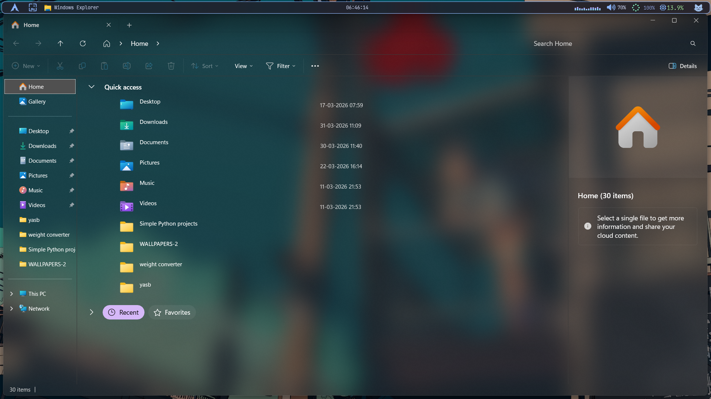

# __📁 ExplorerBlurMica__

Add Blur / Acrylic / Mica effect to File Explorer (Windows 10/11).

---

# 👁️Preview

- __Blur Mica__

---

> [!⚠️ Note]

>Some users reported bugs and crashes while using this.  
>please , don't mindrestarting this allplication when crash happens.

>please! Turn "ON" Transparency Effects in your system settings (Windows10 or Windows11)

---

⚙️ __Installation__

You can follow the steps below, or jump to the [setup video](https://youtu.be/gpGeCZXXsbs?si=iYIVyy0m0Kj358vN).

1. Install [ExplorerBlurMica](https://github.com/Maplespe/ExplorerBlurMica/releases)  

2. Copy the config file from  
   → [here](./config.ini)

3. For further setup, follow the [official installation guide](https://github.com/Maplespe/ExplorerBlurMica) 

---
- __*Setup credit*__ [SleepycatHey!](https://www.youtube.com/@SleepyCatHey) 💙💙