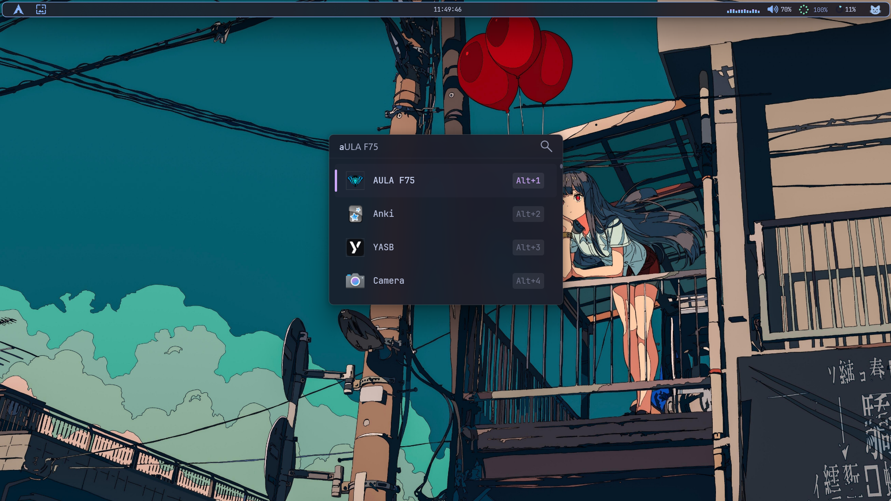

🔍 Flow Launcher
---
Quick File Search & App Launcher for Windows.

---
👁️Preview
---

- __Theme__

- __Apperance__

 
---
⚠️ Note
---
«Some parts of this theme may not work exactly the same on your system.
Make sure to:»

- Use latest version of Flow Launcher  
- Restart Flow Launcher after applying theme  
- Enable "Transparency Effects"(in your system settings) if blur doesn’t work  

---

📂 Files Included

→ Theme file  (catppuccin mocha)

---

⚙️ Installation

1. Install [Flow Launcher](https://www.flowlauncher.com/)  

2. Download the theme file from [here](./Theme/Catppuccin%20Mocha.xaml)  

3. Open Flow Launcher Settings → Appearance → "Open Theme Folder"  

4. Move the downloaded file into that folder  

5. Restart Flow Launcher  

6. Select the theme from Appearance  

---

💡 Tips

«If changes don’t apply, try restarting Flow Launcher.»

---
 __*ENJOY*__ !!😺