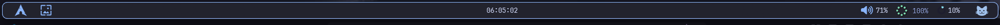
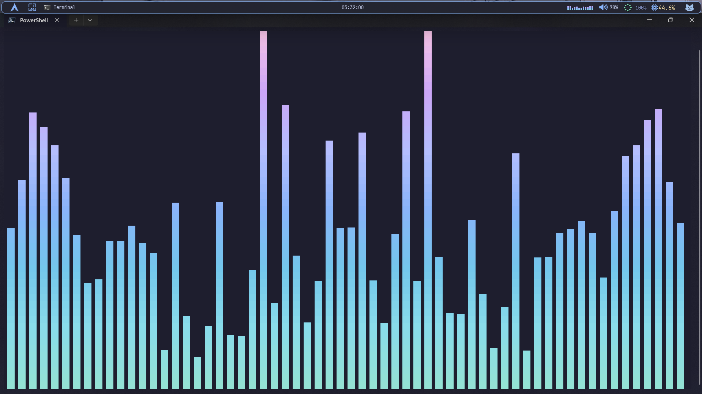

# __✨ My Ultimate Windows 11 Setup ✨__

A collection of my personal Windows 11 customisations — focused on a clean, aesthetic, and productive workflow.

---

🖼️ Preview

- __YASB__

- __Flow Launcher__

- __cava__

- __File Explorer(Blur Mica)__

---

## 📦 Apps & Tools Used

| 📚Category | ⚒️Tool |
|---------------------------------|------|
| Status Bar                 | [YASB](YASB/README.md)|
| App Launcher               | [Flow Launcher](./Flow%20Launcher/README.md)|
| Taskbar                    | [Windhawk](./windhawk/README.md)|
| Terminal                   | [PowerShell 7-x64](./Terminal/README.md)|
| Code Editor                | VS Code|
| Audio Visualizer           | [cava](./cava/README.md)
| Discord                    | [Vencord Browser Extension](http://vencord.dev/download/)|
| Browser                    | [Brave](https://brave.com/)|
| Music Player               | [Yt Music💀](https://music.youtube.com/)|
File Explorer                | [Blur Mica](./File%20Explorer(Blur%20mica)/)
| My personal fav. wallpapers| [Wallpapers](./Wallpapers/)

---

🎨 Theme

- Colorscheme: [Catppuccin (Mocha)](https://catppuccin.com/)
- Font: [JetBrains Mono Nerd Font](https://www.jetbrains.com/lp/mono/)

---

⚙️ Setup Guide

Each folder in this repository contains configuration files for a specific tool.

»General Steps:

1. Install the required application
2. Open its config/settings
3. Copy the config files from this repo
4. Paste and replace your existing config
5. Restart the application

---
---

⚠️ Notes

- Some configs may require editing paths (like your username or file locations)
- Certain features may not work without API keys or additional setup
- This setup is tailored for my system — adjust as needed

---

🚧 Status

This project is still in progress. I will keep improving and adding more configs over time.

---

🎯 Goal

To build a minimal, aesthetic, and highly productive Windows 11 environment.

---

⭐ Credits

Inspired by the Windows customization community.

---

📌 Extras (Coming Soon)

- Screenshots
- More tools and tweaks
