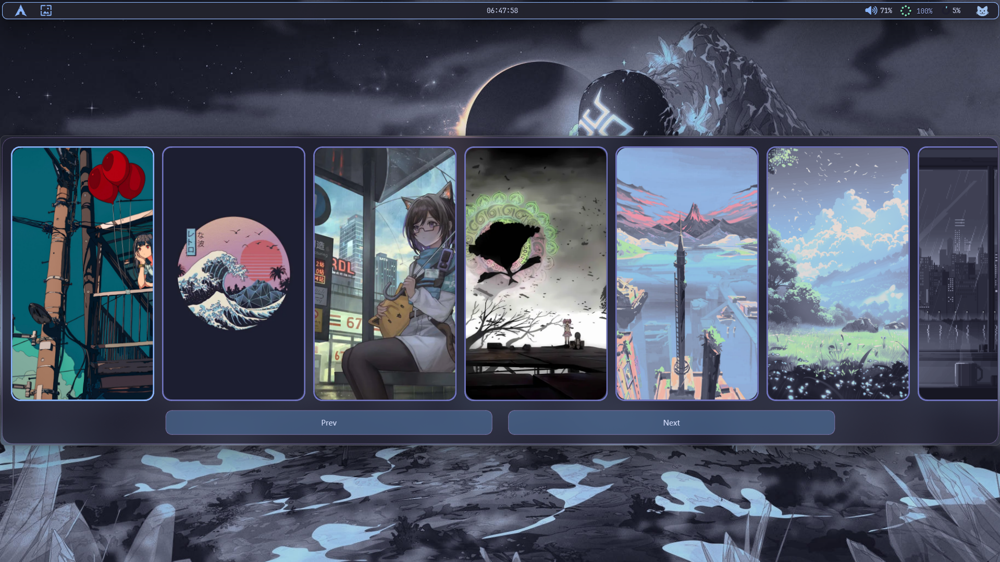
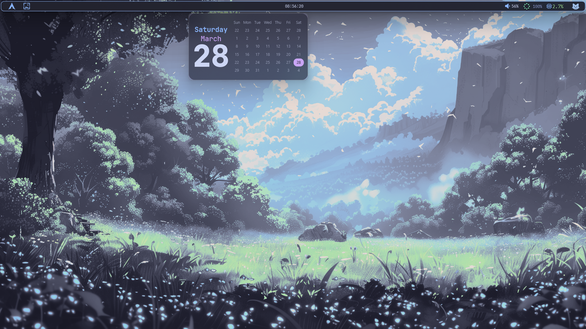
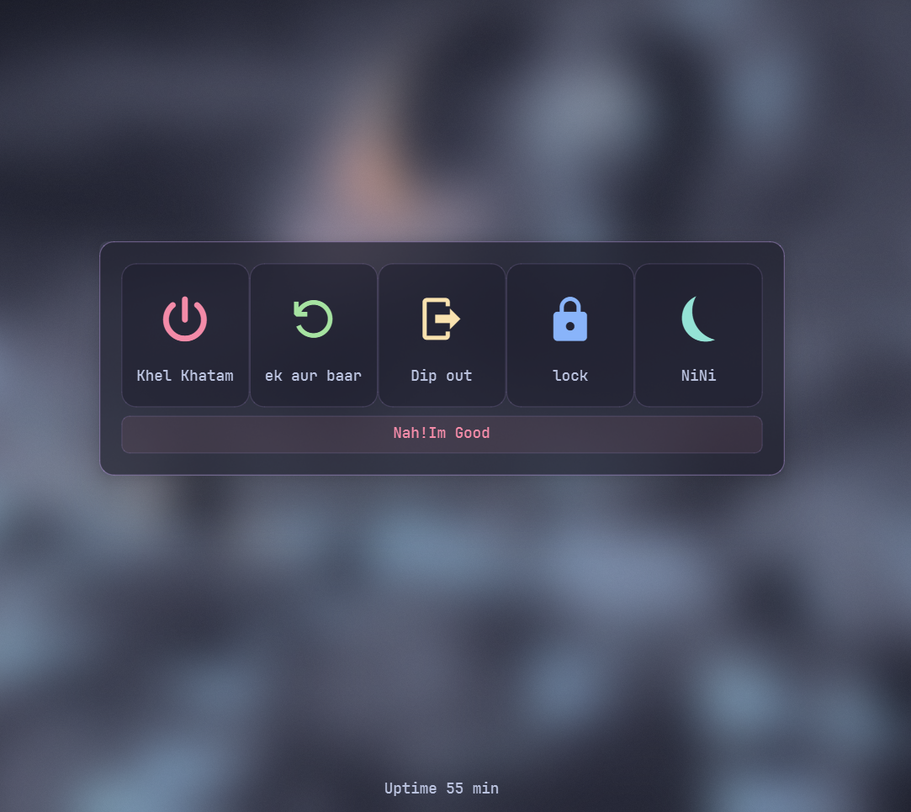
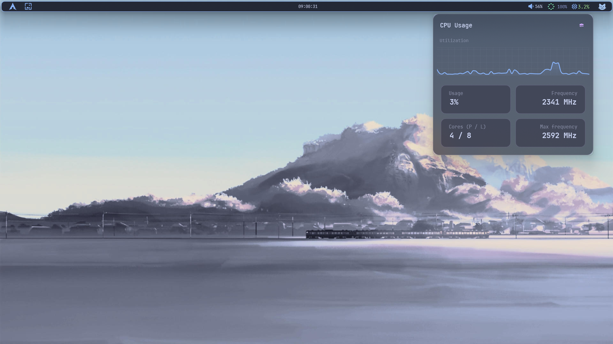

📏 YASB Configuration

A highly customizable Windows status bar built with Python.

---
👁️Preview
---
- __Bar__

- __wallpapers widget__

- __Calender widget__

- __PowerMenu widget__

- __CPU Widget-POPUP__

---

⚠️ Note
---
«Some parts of this config may not work directly on your system.
Make sure to:

- Add your API key (for weather widget)
- Update wallpaper folder paths
- Adjust any user-specific settings»
- if blur effect doesn't work , Toggle ON "TRANSPARENCY EFFECTS" in your system settings

---

📂 Files Included

- ["config.yaml"](./config.yaml) → Main configuration
- ["style.css"](./style.css) → Styling for the bar

---

⚙️ Installation

1. Install [YASB](https://github.com/amnweb/yasb) 
2. Copy the files (.css and .config) from it's folder
3. Replace your existing YASB config files
4. Restart YASB

---

💡 Tips

«If changes don’t apply, try restarting YASB or your system.»

---

🚧 Status

Work in progress — more improvements coming soon.