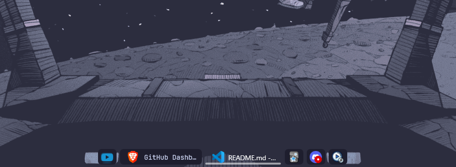

🦅 Windhawk
---
Customize Windows programs with advanced mod configurations.

---

👁️Preview
---

- __Taskbar__

- __Start Menu__

- __System Tray__

- __NoTification center__

---

⚠️ Note
---
«If you're using my taskbar config, it may remove the Start menu and network icon.  
To add them back, follow the steps below.»

---

⚙️ __Installation__

You can follow the steps below, or jump to the [setup video](https://youtu.be/rTojCaKgz38?si=kCcZdwEBs5wvtjcE) if you want more details about the taskbar.

1. Install [Windhawk](https://windhawk.net/)  

2. Copy the config file from  [here](../windhawk).

3. Open your Windhawk mod → go to Advanced section  

4. Remove existing codes and paste the copied config  

5. Click Save settings for changes to apply  

---
- [__setup video credit__](https://www.youtube.com/@SleepyCatHey) 💙💙